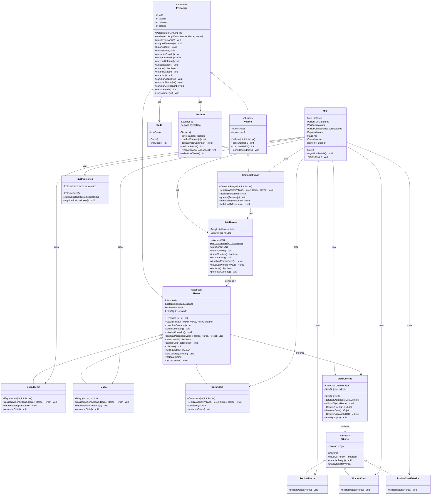
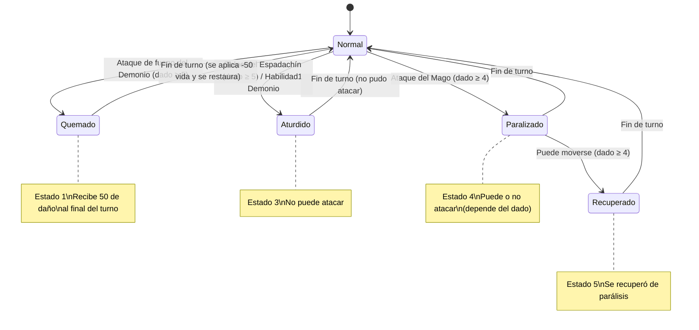
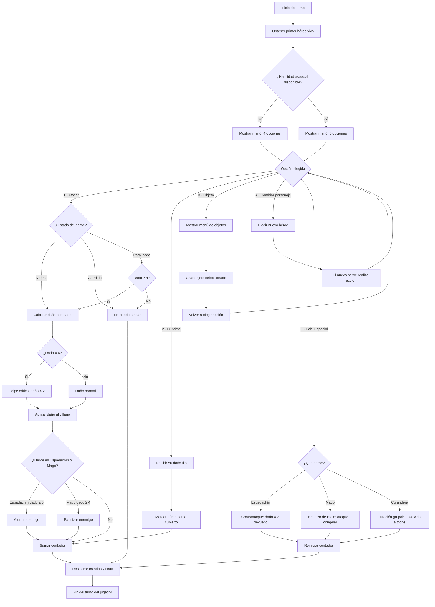
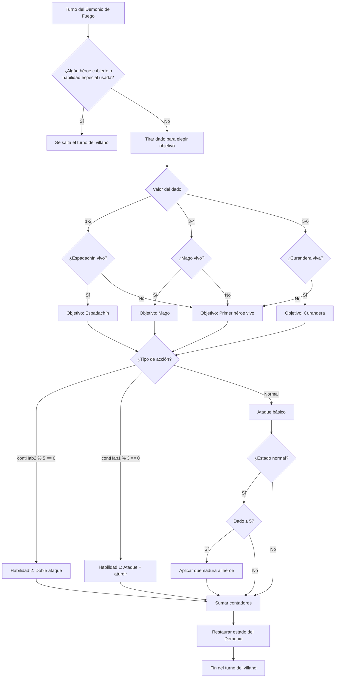
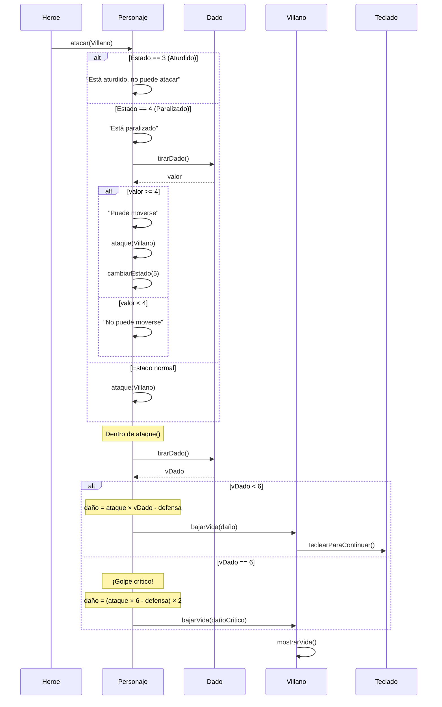
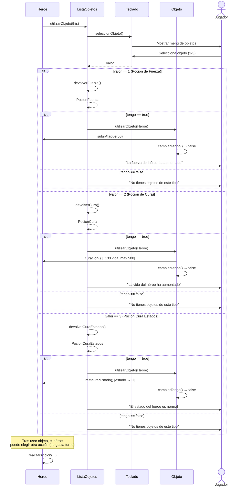
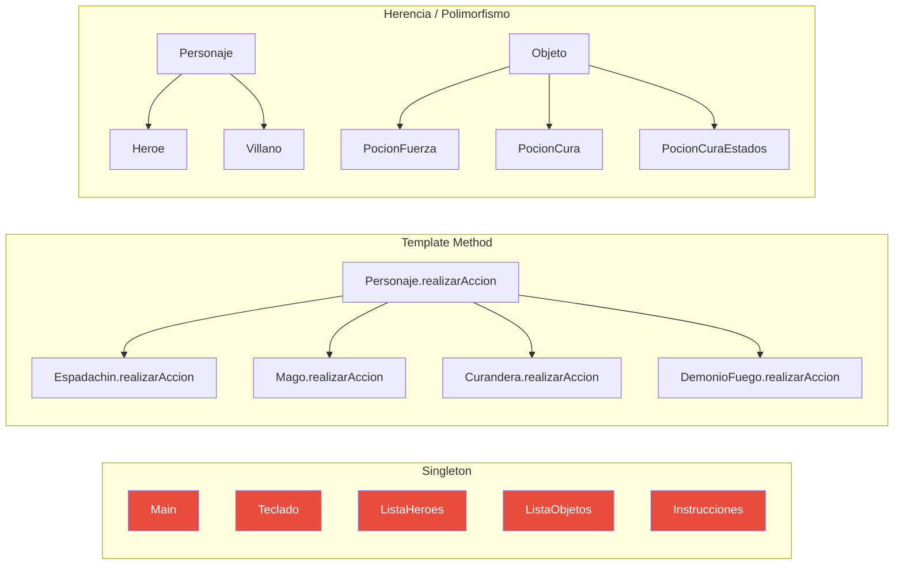
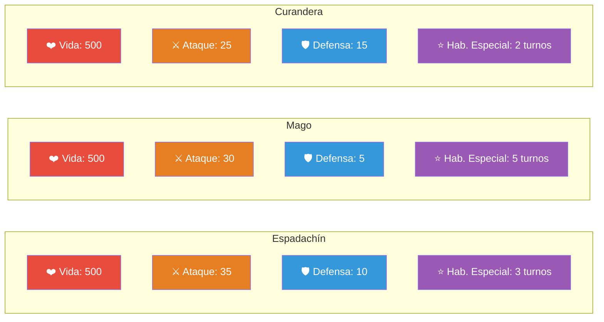

# 🎮 Documentación del Juego — Héroes vs Demonio de Fuego

> **Proyecto de Programación Orientada a Objetos**  
> Autores: G. Ruiz, I. Salazar, U. Iguarán  
> Lenguaje: Java

---

## 📖 Índice

1. [Descripción General](#1--descripción-general)
2. [Mecánicas del Juego](#2--mecánicas-del-juego)
3. [Diagrama de Clases](#3--diagrama-de-clases)
4. [Descripción Detallada de las Clases](#4--descripción-detallada-de-las-clases)
   - [Personaje (abstracta)](#41-personaje-abstracta)
   - [Heroe (abstracta)](#42-heroe-abstracta)
   - [Villano (abstracta)](#43-villano-abstracta)
   - [Espadachin](#44-espadachin)
   - [Mago](#45-mago)
   - [Curandera](#46-curandera)
   - [DemonioFuego](#47-demoniofuego)
   - [Objeto (abstracta)](#48-objeto-abstracta)
   - [PocionFuerza](#49-pocionfuerza)
   - [PocionCura](#410-pocioncura)
   - [PocionCuraEstados](#411-pocioncuraestados)
   - [ListaHeroes](#412-listaheroes)
   - [ListaObjetos](#413-listaobjetos)
   - [Dado](#414-dado)
   - [Teclado](#415-teclado)
   - [Instrucciones](#416-instrucciones)
   - [Main](#417-main)
5. [Diagrama de Herencia](#5--diagrama-de-herencia)
6. [Diagrama de Estados de un Personaje](#6--diagrama-de-estados-de-un-personaje)
7. [Diagrama de Flujo del Turno del Jugador](#7--diagrama-de-flujo-del-turno-del-jugador)
8. [Diagrama de Flujo del Turno del Villano](#8--diagrama-de-flujo-del-turno-del-villano)
9. [Diagrama de Secuencia — `jugarUnaPartida()`](#9--diagrama-de-secuencia--jugarunapartida)
10. [Diagrama de Secuencia — Combate (Atacar)](#10--diagrama-de-secuencia--combate-atacar)
11. [Diagrama de Secuencia — Utilizar Objeto](#11--diagrama-de-secuencia--utilizar-objeto)
12. [Patrones de Diseño Utilizados](#12--patrones-de-diseño-utilizados)
13. [Sistema de Combate — Fórmulas](#13--sistema-de-combate--fórmulas)
14. [Estadísticas de los Personajes](#14--estadísticas-de-los-personajes)
15. [Sistema de Estados Alterados](#15--sistema-de-estados-alterados)
16. [Objetos Consumibles](#16--objetos-consumibles)

---

## 1. 📝 Descripción General

El juego es un **RPG por turnos** en consola desarrollado en **Java**, donde el jugador controla a un equipo de **tres héroes** (Espadachín, Mago y Curandera) que deben derrotar a un poderoso **Demonio de Fuego**.

### Objetivo
- **Victoria:** Reducir la vida del Demonio de Fuego a 0.
- **Derrota:** Que los tres héroes pierdan todos sus puntos de vida.
- **Puntuación:** La suma de la vida restante de los tres héroes al ganar la partida.

### Características principales
- Sistema de turnos alternados (jugador → villano).
- Tres héroes jugables con habilidades especiales únicas.
- Sistema de dados para el cálculo de daño.
- Estados alterados (quemadura, aturdimiento, parálisis).
- Inventario de objetos consumibles compartido.
- Habilidades especiales que se desbloquean tras cierto número de turnos.

---

## 2. 🎯 Mecánicas del Juego

### Flujo de un turno

1. Se asigna automáticamente el **primer héroe vivo** al jugador.
2. El jugador elige entre **4 acciones** (o 5 si la habilidad especial está disponible):
   - `1` — **Atacar** al Demonio de Fuego.
   - `2` — **Cubrirse** (recibe daño reducido fijo de 50).
   - `3` — **Utilizar un objeto** (no gasta turno, permite elegir otra acción después).
   - `4` — **Cambiar de personaje** (el turno pasa al héroe seleccionado).
   - `5` — **Habilidad especial** (solo disponible tras X turnos de acción del héroe).
3. Se aplican estados alterados y se restauran stats de los héroes.
4. Si ningún héroe usó habilidad especial ni se cubrió, el **Demonio de Fuego** realiza su turno.
5. El ciclo se repite hasta que un bando sea derrotado.

### Cálculo de daño

```
daño = ataque × tiradaDado - defensaEnemigo
```

Si el dado saca **6** → **Golpe crítico**: el daño se **duplica**.

---

## 3. 📊 Diagrama de Clases



---

## 4. 📚 Descripción Detallada de las Clases

### 4.1 Personaje (abstracta)

Clase base de la jerarquía de personajes. Define los atributos y comportamientos comunes.

| Atributo | Tipo | Descripción |
|----------|------|-------------|
| `vida` | `int` | Puntos de vida del personaje |
| `ataque` | `int` | Valor de ataque base |
| `defensa` | `int` | Valor de defensa (reduce daño recibido) |
| `estado` | `int` | Estado alterado actual (0=normal, 1=quemado, 3=aturdido, 4=paralizado, 5=recuperado) |

**Métodos principales:**
- `atacar(Personaje)`: Comprueba estados antes de atacar. Si está aturdido, no puede atacar. Si está paralizado, tira un dado y necesita ≥4 para poder atacar.
- `ataque(Personaje)`: Ejecuta la fórmula de daño con dado. Si el dado saca 6, golpe crítico (daño ×2).
- `bajarVida(int)`: Reduce la vida y comprueba si el personaje ha muerto.
- `aplicarEstado()`: Si está quemado (estado=1), recibe 50 de daño.
- `curacion()`: Recupera 100 de vida, con un máximo de 500.

---

### 4.2 Heroe (abstracta)

Extiende `Personaje` y añade mecánicas propias de los héroes.

| Atributo | Tipo | Descripción |
|----------|------|-------------|
| `contador` | `int` | Número de acciones realizadas (para desbloquear habilidad especial) |
| `habilidadEspecial` | `boolean` | Indica si se ha usado la habilidad especial este turno |
| `cubierto` | `boolean` | Indica si el héroe se está cubriendo |
| `mochila` | `ListaObjetos` | Referencia al inventario compartido de objetos |

**Métodos principales:**
- `cambiarPersonaje(...)`: Permite al jugador elegir otro héroe para controlar.
- `cubrirse()`: El héroe se cubre, recibiendo solo 50 de daño fijo y bloqueando el turno del villano para el resto del equipo.
- `utilizarObjeto()`: Delega en `ListaObjetos` para usar un objeto.

---

### 4.3 Villano (abstracta)

Extiende `Personaje` y añade contadores para las habilidades especiales del villano.

| Atributo | Tipo | Descripción |
|----------|------|-------------|
| `contHab1` | `int` | Contador para la habilidad 1 (cada 3 turnos) |
| `contHab2` | `int` | Contador para la habilidad 2 (cada 5 turnos) |

---

### 4.4 Espadachin

Héroe cuerpo a cuerpo con alta defensa y capacidad de aturdir.

| Propiedad | Valor |
|-----------|-------|
| Vida | 500 |
| Ataque | 35 |
| Defensa | 10 |
| Habilidad especial | **Contraataque** (se desbloquea tras 3 acciones) |
| Efecto pasivo | Al atacar, probabilidad de **aturdir** al enemigo (dado ≥ 5) |

**Habilidad especial — Contraataque (`coontrataque`):**
1. El enemigo ataca al Espadachín.
2. El daño recibido se devuelve **multiplicado por 2** al enemigo.
3. Reinicia el contador de acciones.

---

### 4.5 Mago

Héroe mágico con capacidad de paralizar al enemigo.

| Propiedad | Valor |
|-----------|-------|
| Vida | 500 |
| Ataque | 30 |
| Defensa | 5 |
| Habilidad especial | **Hechizo de Hielo** (se desbloquea tras 5 acciones) |
| Efecto pasivo | Al atacar, probabilidad de **paralizar** al enemigo (dado ≥ 4) |

**Habilidad especial — Hechizo de Hielo (`hechizoHielo`):**
1. El Mago ataca al enemigo.
2. El enemigo queda **congelado** (no puede atacar en su turno).
3. Reinicia el contador de acciones.

---

### 4.6 Curandera

Héroe de soporte con capacidad de curación grupal.

| Propiedad | Valor |
|-----------|-------|
| Vida | 500 |
| Ataque | 25 |
| Defensa | 15 |
| Habilidad especial | **Curación grupal** (se desbloquea tras 2 acciones) |

**Habilidad especial — Curación (`Curacion`):**
1. Todos los héroes vivos recuperan **100 puntos de vida** (máximo 500).
2. Reinicia el contador de acciones.

---

### 4.7 DemonioFuego

El villano principal del juego. Enemigo formidable con múltiples habilidades.

| Propiedad | Valor |
|-----------|-------|
| Vida | 1500 |
| Ataque | 45 |
| Defensa | 15 |

**Comportamiento en su turno:**
1. Se tira un dado para elegir **aleatoriamente** al héroe objetivo (1-2: Espadachín, 3-4: Mago, 5-6: Curandera).
2. Si el héroe elegido está muerto, se selecciona el primer héroe vivo.
3. Dependiendo de los contadores de turno:
   - **Cada 5 turnos** → `habilidad2`: Ataque doble (ataca dos veces seguidas).
   - **Cada 3 turnos** → `habilidad1`: Ataque especial que **aturde** al héroe.
   - **Turno normal** → Ataque básico + probabilidad de **quemadura** (dado ≥ 5).

---

### 4.8 Objeto (abstracta)

Clase base para los objetos consumibles del juego.

| Atributo | Tipo | Descripción |
|----------|------|-------------|
| `tengo` | `boolean` | Indica si el objeto aún está disponible |

Método abstracto `utilizarObjeto(Heroe)` que cada subclase implementa.

---

### 4.9 PocionFuerza

Aumenta el ataque del héroe en **+50** puntos. Uso único.

---

### 4.10 PocionCura

Cura al héroe en **+100** de vida (máximo 500). Uso único.

---

### 4.11 PocionCuraEstados

Restaura el estado del héroe a **normal** (elimina quemadura, aturdimiento o parálisis). Uso único.

---

### 4.12 ListaHeroes

Gestiona la colección de héroes del jugador. Implementa el patrón **Singleton**.

**Métodos principales:**
- `todosMuertos()`: Comprueba si todos los héroes han muerto (condición de derrota).
- `devolverPrimeroVivo()`: Devuelve el primer héroe vivo de la lista con mensaje informativo.
- `restauracion()`: Aplica y limpia estados alterados, restaura stats de todos los héroes.
- `curacion()`: Cura a todos los héroes vivos (usado por la habilidad de la Curandera).
- `cubierto()`: Comprueba si algún héroe se está cubriendo.

---

### 4.13 ListaObjetos

Gestiona el inventario de objetos consumibles. Implementa el patrón **Singleton**.

**Métodos principales:**
- `utilizarObjeto(Heroe)`: Muestra menú de objetos y aplica el efecto del objeto seleccionado.
- `devolverFuerza()`, `devolverCura()`, `devolverCuraEstados()`: Buscan y devuelven el objeto correspondiente.

---

### 4.14 Dado

Simula un dado de 6 caras. Utiliza `java.util.Random`.

```java
tiradaDado() → valor entre 1 y 6 (inclusive)
```

---

### 4.15 Teclado

Gestiona toda la entrada del usuario por consola. Implementa el patrón **Singleton**.

**Menús disponibles:**
- `realizarAccion()`: Menú de 4 opciones (Atacar, Cubrirse, Objeto, Cambiar).
- `realizarAccionHabEspecial()`: Menú de 5 opciones (las 4 anteriores + Habilidad Especial).
- `cambioPersonaje()`: Selector de héroe (1-Espadachín, 2-Mago, 3-Curandera).
- `seleccionObjeto()`: Selector de objeto (1-Fuerza, 2-Cura, 3-CuraEstados).

---

### 4.16 Instrucciones

Lee e imprime las instrucciones del juego desde un archivo de texto. Implementa el patrón **Singleton**.

---

### 4.17 Main

Punto de entrada del juego. Implementa el patrón **Singleton**. Crea todos los personajes y objetos, y ejecuta el bucle principal del juego en `jugarUnaPartida()`.

---

## 5. 🧬 Diagrama de Herencia

```mermaid
graph TD
    A[Personaje<br/>&#60;&#60;abstract&#62;&#62;] --> B[Heroe<br/>&#60;&#60;abstract&#62;&#62;]
    A --> C[Villano<br/>&#60;&#60;abstract&#62;&#62;]
    B --> D[Espadachin]
    B --> E[Mago]
    B --> F[Curandera]
    C --> G[DemonioFuego]

    H[Objeto<br/>&#60;&#60;abstract&#62;&#62;] --> I[PocionFuerza]
    H --> J[PocionCura]
    H --> K[PocionCuraEstados]

    style A fill:#e74c3c,color:#fff
    style B fill:#3498db,color:#fff
    style C fill:#8e44ad,color:#fff
    style D fill:#2ecc71,color:#fff
    style E fill:#2ecc71,color:#fff
    style F fill:#2ecc71,color:#fff
    style G fill:#e67e22,color:#fff
    style H fill:#f39c12,color:#fff
    style I fill:#1abc9c,color:#fff
    style J fill:#1abc9c,color:#fff
    style K fill:#1abc9c,color:#fff
```



---

## 6. 🔄 Diagrama de Estados de un Personaje



---

## 7. 🗺️ Diagrama de Flujo del Turno del Jugador



---

## 8. 👹 Diagrama de Flujo del Turno del Villano



---

## 9. 🔁 Diagrama de Secuencia — `jugarUnaPartida()`

Este es el diagrama de secuencia principal que muestra el flujo completo del método `jugarUnaPartida()` de la clase `Main`.

```mermaid
sequenceDiagram
    actor Jugador
    participant Main
    participant Inst as Instrucciones
    participant LO as ListaObjetos
    participant LH as ListaHeroes
    participant Heroe
    participant DF as DemonioFuego
    participant Es as Espadachin
    participant Mg as Mago
    participant Cu as Curandera
    participant Tc as Teclado

    Note over Main: jugarUnaPartida() comienza

    %% Fase de Inicialización
    rect rgb(200, 230, 255)
        Note over Main, Inst: FASE 1 - Inicialización
        Main->>Inst: getInstrucciones()
        Inst-->>Main: instancia Singleton
        Main->>Inst: imprimirInstrucciones()
        Inst->>Jugador: Muestra instrucciones del juego
        Inst->>Tc: TeclearParaContinuar()
        Jugador->>Tc: Presiona Enter

        Main->>LO: getListaObjetos()
        LO-->>Main: instancia Singleton
        Main->>LO: anadir(PocionFuerza)
        Main->>LO: anadir(PocionCura)
        Main->>LO: anadir(PocionCuraEstados)

        Main->>LH: getListaHeroes()
        LH-->>Main: instancia Singleton
        Main->>LH: anadir(Espadachin)
        Main->>LH: anadir(Mago)
        Main->>LH: anadir(Curandera)
    end

    %% Bucle principal de la partida
    rect rgb(255, 245, 200)
        Note over Main, DF: FASE 2 - Bucle principal de combate

        loop Mientras héroes vivos Y Demonio vivo
            Main->>LH: todosMuertos()
            LH-->>Main: false
            Main->>DF: muerto()
            DF-->>Main: false

            Note over Main: "Turno de los héroes"

            %% Turno de los héroes
            rect rgb(200, 255, 200)
                Note over LH, Heroe: TURNO DEL JUGADOR
                Main->>LH: devolverPrimeroVivo()
                LH->>LH: Iterar lista de héroes
                LH->>Jugador: Muestra héroe activo
                LH->>Tc: TeclearParaContinuar()
                Jugador->>Tc: Presiona Enter
                LH-->>Main: Héroe (primer vivo)

                Main->>Heroe: realizarAccion(DF, Es, Mg, Cu)
                Note over Heroe: El héroe ejecuta la acción elegida por el jugador
                Heroe->>Tc: realizarAccion() o realizarAccionHabEspecial()
                Tc->>Jugador: Mostrar menú de acciones
                Jugador->>Tc: Elige acción (1-5)
                Tc-->>Heroe: opción elegida

                alt Opción 1 - Atacar
                    Heroe->>DF: atacar(DemonioFuego)
                    Note over Heroe, DF: Se calcula daño con dado
                else Opción 2 - Cubrirse
                    Heroe->>Heroe: cubrirse()
                    Note over Heroe: Recibe 50 daño fijo, se marca cubierto
                else Opción 3 - Usar Objeto
                    Heroe->>LO: utilizarObjeto(this)
                    LO->>Tc: seleccionObjeto()
                    Tc->>Jugador: Mostrar menú de objetos
                    Jugador->>Tc: Elige objeto
                    LO->>Heroe: Aplicar efecto del objeto
                    Note over Heroe: Vuelve a elegir acción (no gasta turno)
                else Opción 4 - Cambiar Personaje
                    Heroe->>Tc: cambioPersonaje()
                    Tc->>Jugador: Elegir héroe
                    Jugador->>Tc: Elige héroe
                    Note over Heroe: El nuevo héroe realiza acción
                else Opción 5 - Habilidad Especial
                    Note over Heroe: Ejecuta habilidad según tipo de héroe
                end
            end

            %% Restauración
            rect rgb(230, 230, 255)
                Note over Main, LH: RESTAURACIÓN
                Main->>LH: restauracion()
                LH->>LH: Para cada héroe: aplicarEstado() + restaurarEstado() + restaurarStats()
            end

            %% Verificación de habilidad especial / cubierto
            alt Habilidad especial usada o héroe cubierto
                Main->>Es: cambioConHab(false)
                Main->>Mg: cambioConHab(false)
                Main->>LH: ponerNoCubierto()
                Note over Main: Se salta turno del villano
            else Demonio NO muerto
                %% Turno del Demonio de Fuego
                rect rgb(255, 200, 200)
                    Note over DF: TURNO DEL DEMONIO DE FUEGO
                    Main->>Tc: TeclearParaContinuar()
                    Jugador->>Tc: Presiona Enter
                    Note over Main: "Turno del demonio de fuego"
                    Main->>DF: realizarAccion(DF, Es, Mg, Cu)
                    DF->>DF: Tirar dado para elegir objetivo
                    alt Ataque normal
                        DF->>Heroe: atacar(héroe_elegido)
                        DF->>Heroe: quema(héroe_elegido) [probabilidad]
                    else Habilidad 1 (cada 3 turnos)
                        DF->>Heroe: habilidad1(héroe_elegido)
                        Note over DF, Heroe: Ataque especial + aturdir
                    else Habilidad 2 (cada 5 turnos)
                        DF->>Heroe: habilidad2(héroe_elegido)
                        Note over DF, Heroe: Doble ataque
                    end
                    DF->>DF: sumarContadores()
                    Main->>DF: restaurarEstado()
                    Main->>Tc: TeclearParaContinuar()
                    Jugador->>Tc: Presiona Enter
                end
            end
        end
    end

    %% Fase de resultado
    rect rgb(255, 220, 255)
        Note over Main: FASE 3 - Resultado de la partida
        alt Demonio de Fuego muerto
            Main->>DF: muerto()
            DF-->>Main: true
            Main->>Jugador: "¡Enhorabuena! Has derrotado al villano!"
            Main->>Es: devolverVida()
            Main->>Mg: devolverVida()
            Main->>Cu: devolverVida()
            Main->>Jugador: Muestra puntuación (suma de vidas)
        else Todos los héroes muertos
            Main->>Jugador: "Vaya, otra vez será. ¡Inténtalo de nuevo!"
        end
    end
```



---

## 10. ⚔️ Diagrama de Secuencia — Combate (Atacar)



---

## 11. 🧪 Diagrama de Secuencia — Utilizar Objeto



---

## 12. 🏗️ Patrones de Diseño Utilizados



### Patrones identificados:

| Patrón | Clases | Descripción |
|--------|--------|-------------|
| **Singleton** | `Main`, `Teclado`, `ListaHeroes`, `ListaObjetos`, `Instrucciones` | Garantizan una única instancia global con acceso estático (`getXxx()`) |
| **Template Method** | `Personaje` → subclases | `realizarAccion()` es abstracto y cada subclase implementa su propio comportamiento |
| **Polimorfismo** | `Heroe`, `Villano`, `Objeto` | Cada subclase redefine métodos como `realizarAccion()`, `utilizarObjeto()`, `restaurarStats()` |
| **Iterator** | `ListaHeroes`, `ListaObjetos` | Uso de `Iterator<>` para recorrer las colecciones de héroes y objetos |

---

## 13. ⚙️ Sistema de Combate — Fórmulas

### Ataque normal

$$\text{daño} = \text{Ataque}_{\text{atacante}} \times \text{Dado}_{(1-5)} - \text{Defensa}_{\text{defensor}}$$

### Golpe crítico (dado = 6)

$$\text{daño}_{crítico} = (\text{Ataque}_{\text{atacante}} \times 6 - \text{Defensa}_{\text{defensor}}) \times 2$$

### Contraataque del Espadachín

$$\text{daño}_{contraataque} = (\text{Ataque}_{\text{enemigo}} \times \text{Dado} - \text{Defensa}_{\text{espadachín}}) \times 2$$

### Cubrirse

$$\text{daño}_{cubierto} = 50 \text{ (fijo)}$$

### Quemadura (estado)

$$\text{daño}_{quemadura} = 50 \text{ (al final del turno del jugador)}$$

---

## 14. 📋 Estadísticas de los Personajes

### Héroes



| Personaje | Vida | Ataque | Defensa | Hab. Especial | Turnos para Hab. |
|-----------|------|--------|---------|---------------|-------------------|
| **Espadachín** | 500 | 35 | 10 | Contraataque | 3 |
| **Mago** | 500 | 30 | 5 | Hechizo de Hielo | 5 |
| **Curandera** | 500 | 25 | 15 | Curación grupal | 2 |

### Villano

| Personaje | Vida | Ataque | Defensa | Hab. 1 | Hab. 2 |
|-----------|------|--------|---------|--------|--------|
| **Demonio de Fuego** | 1500 | 45 | 15 | Ataque + Aturdir (cada 3 turnos) | Doble ataque (cada 5 turnos) |

---

## 15. 🔥 Sistema de Estados Alterados

| Código | Estado | Efecto | Duración | Quién lo causa |
|--------|--------|--------|----------|----------------|
| `0` | **Normal** | Sin efecto | — | — |
| `1` | **Quemado** | Recibe 50 de daño al final del turno | 1 turno | Demonio de Fuego (dado ≥ 5) |
| `3` | **Aturdido** | No puede atacar | 1 turno | Espadachín (dado ≥ 5) / Demonio Hab.1 |
| `4` | **Paralizado** | Puede o no atacar (dado ≥ 4 para moverse) | 1 turno | Mago (dado ≥ 4) |
| `5` | **Recuperado** | Se recuperó de la parálisis, turno normal | Inmediato | Sistema (tras superar parálisis) |

---

## 16. 🎒 Objetos Consumibles

| Objeto | Efecto | Uso | Gasta turno |
|--------|--------|-----|-------------|
| **Poción de Fuerza** | +50 ataque al héroe | Único | ❌ No |
| **Poción de Cura** | +100 vida (máx. 500) | Único | ❌ No |
| **Poción Cura Estados** | Restaura estado a normal | Único | ❌ No |

> ⚠️ **Nota:** Los efectos de la Poción de Fuerza solo duran el turno actual, ya que `restaurarStats()` se ejecuta al final de cada turno restaurando los valores base de ataque y defensa.

---

## 📁 Estructura del Proyecto

```
Proyecto/
├── Main.java              # Punto de entrada y controlador principal
├── Personaje.java         # Clase abstracta base de personajes
├── Heroe.java             # Clase abstracta de héroes
├── Villano.java           # Clase abstracta de villanos
├── Espadachin.java        # Héroe: Espadachín
├── Mago.java              # Héroe: Mago
├── Curandera.java         # Héroe: Curandera
├── DemonioFuego.java      # Villano: Demonio de Fuego
├── Objeto.java            # Clase abstracta de objetos
├── PocionFuerza.java      # Objeto: Poción de Fuerza
├── PocionCura.java        # Objeto: Poción de Cura
├── PocionCuraEstados.java # Objeto: Poción Cura Estados
├── ListaHeroes.java       # Gestión de la colección de héroes
├── ListaObjetos.java      # Gestión del inventario de objetos
├── Dado.java              # Simulador de dado de 6 caras
├── Teclado.java           # Entrada de usuario por consola
├── Instrucciones.java     # Lectura e impresión de instrucciones
├── Ejemplo.txt            # Archivo de texto con instrucciones
└── Juego.jar              # Ejecutable del juego
```

---

> 📄 *Documentación generada a partir del análisis del código fuente del proyecto.*
